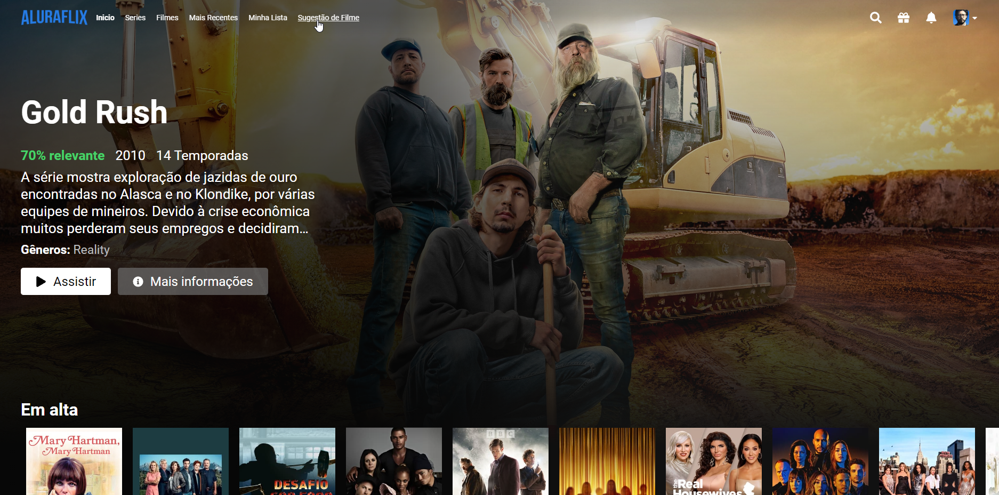
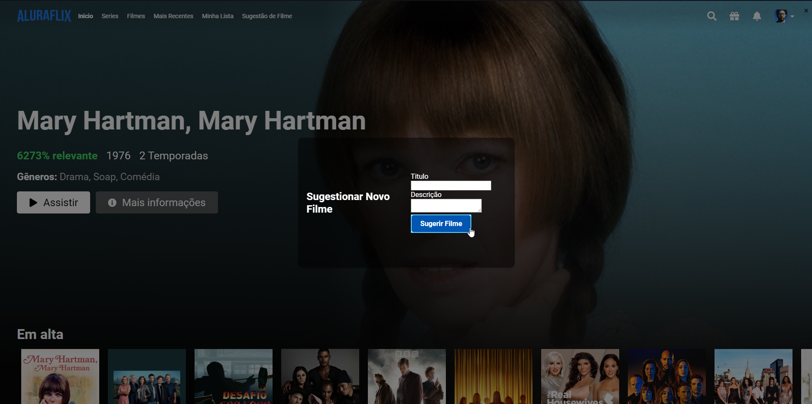

# Aluraflix

<h3 align = "center">
  Clone da plataforma de streaming <a href="https://www.netflix.com/">Netflix</a>
</h3>

Este é um projeto desenvolvido para o Challenge Alura Oracle One, onde o objetivo era criar uma plataforma de streaming de vídeos chamada Aluraflix.

## Descrição

Aluraflix é uma aplicação web inspirada em plataformas de streaming de vídeos. Ela permite aos usuários visualizar uma lista de vídeos organizados por categorias e assistir aos vídeos de sua escolha. Como inspiração e fonte de base para o desenvolvimento do projeto Aluraflix foi usado este [vídeo](https://www.youtube.com/watch?v=tBweoUiMsDg&ab_channel=BoniekyLacerda).

Todos os dados dos catálogos como título, descrição, capa, foto de background e avaliação foram extraídos ao usar a [API TMDb](https://www.themoviedb.org/documentation/api).

  

  

